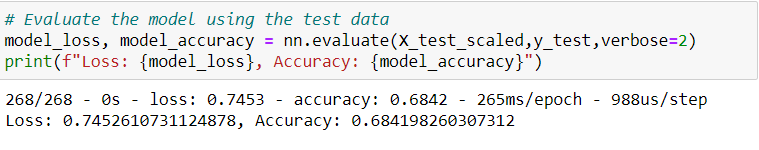
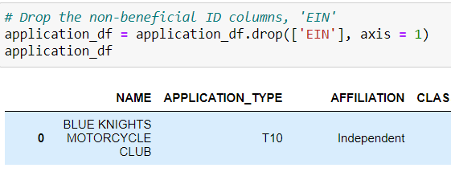
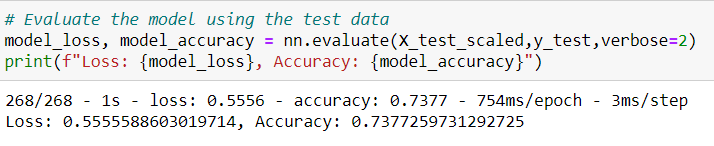
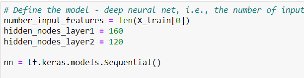
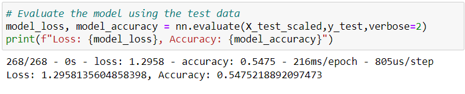
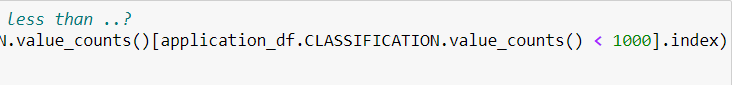
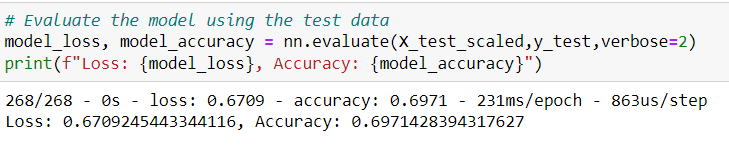

## Neural Network Charity Analysis
Module 19 Challenge

## Overview 

The purpose of this analysis is to use knowledge of machine learning and neural networks to create a binary classifier that is capable of predicting whether applicants will be successful if funded by Alphabet Soup.

To do this, Alphabet Soup’s business team has provided a CSV containing more than 34,000 organizations that have received funding from Alphabet Soup over the years.  Within this dataset are a number of columns that capture metadata about each organization that can be used to help predict success of applicants.

# Results

### Data Preprocessing

 Target for model:

- IS_SUCCESSFUL

Variables considered to be the features for model: 

- APPLICATION_TYPE
- AFFILIATION
- CLASSIFICATION
- USE_CASE
- ORGANIZATION
- INCOME_AMT
- SPECIAL_CONSIDERATIONS

Variables that are neither targets nor features, and were removed from the input data:

- EIN
- NAME

### Compiling, Training, and Evaluating the Model

Two hidden layers, one with 80 and the other with 30 neurons, were used since it is important that a neural network model has an appropriate number of neurons to match the size of the data, the complexity of the problem, and the amount of input neurons.

For a classification model, we only want a yes or no binary decision; therefore, one output neuron was used. In the hidden layers, an ReLU activation function to enable nonlinear relationships was used. For the classification output, sigmoid activation function was used to produce a probability output.

###  Target model performance goal

The target accuracy performance was 75% and our model only reached 68%.  It did not achieve the target model performance. 

### Attempts to increase model performance

In order to improve the accuracy of the model, it was attempted to add the NAME and EIN columns back.  This caused issues trying to run the model. Next just the NAME was added back and the accuracy went up to 73%.  This was the best accuracy obtained. 

Other methods used to try to increase the accuracy included adding neurons and decreasing the threshold amount of the "other" bucket. Both yielded accuracy rates below 70%.

## Summary: 

The original model did not reach the performance requirement of 75% for accuracy and 3 subsequent attempts did not either.  The best accuracy was 73% when the NAME column was added back to the original code.  

I would suggest in the future to try a machine learning model such as Random Forrest Classifier, since they are a type of ensemble learning model that combines multiple smaller models into a more robust and accurate model. The robust nature of Random Forrest models allows for more scalability and can handle outliers.
